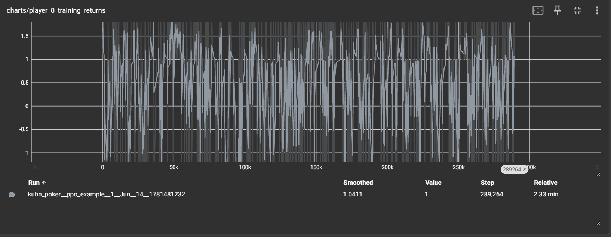

# 线上测试v1报告

花费时间：5-7小时

下载依赖：
本项目使用python3.11
```
pip install -r requirements.txt
```

### 任务A：
1. 跑一个 baseline:双方随机策略对打 ≥10000 局,统计先手/后手平均收益。
```
python open_spiel/python/examples/mcts.py --game=kuhn_poker --player1=random --player2=random --num_games=10000
```
先手/后手平均收益（实际结果可能有差异）：
```output
Number of games played: 10000
Number of distinct games played: 30
Players: random random
Overall wins [5667, 4333]
Overall returns [1394.0, -1394.0]
```

2. 用 **PPO** 训练一个 agent(自我对弈或对抗随机策略,任选并说明理由),给出:训练曲线(收益/loss)、训练后对随机策略的平均收益。

这个ppo_example.py文件中，未设置自我对弈策略，对抗随机策略。因此我选择对抗随机策略。

```
rmdir /s /q runs 
python open_spiel/python/examples/ppo_example.py --game_name=kuhn_poker --num_envs=8 --total_timesteps=100000 --cuda
```
显示训练曲线:
```
tensorboard --logdir=runs 
```
并访问: http://localhost:6006/

这是我已经显示好的训练曲线以及对随即策略的平均收益

平均收益为：0.417


3. 用 OpenSpiel 自带工具计算你训练出的策略的 **exploitability(可利用度)**,并与 OpenSpiel 自带的 **CFR** 跑出的策略对比(CFR 跑通即可,不要求实现)。
测算可利用度：
```
python eval_explo.py
```
exploitability: 0.416722

```
python open_spiel/python/examples/cfr_example.py --game=kuhn_poker 
```
Iteration 0 exploitability 0.45833333333333326<br>
Iteration 10 exploitability 0.06046924690611866<br>
Iteration 20 exploitability 0.039914275345009825<br>
Iteration 30 exploitability 0.024167348753902612<br>
Iteration 40 exploitability 0.020517348345035824<br>
Iteration 50 exploitability 0.014479024570810684<br>
Iteration 60 exploitability 0.014003542854660017<br>
Iteration 70 exploitability 0.011778275229671564<br>
Iteration 80 exploitability 0.010102437916053336<br>
Iteration 90 exploitability 0.00983365028965788<br>

### 任务B：
1. 你的 PPO 策略离纳什均衡差多远(用任务 A3 的数据说话)?为什么自我对弈的 PPO 在不完美信息博弈里**不保证**收敛到纳什均衡?
<br>
因为我目前的ppo只是和随机策略对打，因此其不能学到真正的策略，离纳什均衡差的很远。ppo 本质上是最大化自身reward而并不是寻找均衡策略。并且在自我对弈中，会有无限循环问题,player 0改变更新策略会导致player 1改变策略,player 1改变更新策略又会导致player 0改变策略，循环产生。

2. 如果把奖励从"终局输赢筹码"改成"每一步的密集奖励",会发生什么?请设计一个你认为合理的奖励方案,并说明它可能被策略"钻空子"的方式。
<br>
我个人任务首先ppo对阵随机策略的学习能力会有所提升，但是依然不明显。另外若改成每一步密集奖励，最终可能并不会赢得更多筹码，因为理论上每一步最高奖励为虚张声势（bluff），但如果对手了解到你的策略后会跟你下注，从而在大多数时间虚张声势更容易被对手看穿从而输掉筹码。
<br>
合理的奖励方案为，减少损失或最小化遗憾而非追求最大reward，类似于CFR算法。例如拿到大牌却弃牌应该为reward = -0.5或regret = 0.5， 拿到小牌弃牌reward = -0.1，拿到小牌下注reward = -0.7， 拿到大牌下注reward=0.3。这样的奖励方案比较保守但可以使手里的筹码稳步上升而非追求筹码最大化，高收益意味着高风险。
<br>
可能被钻空子的方式为：对手在发现你永远弃掉小牌后会主动使用虚张声势，从而当双方都拿到小牌时我方必输。对局一旦拉长，可能最终损失筹码。

3. 描述一个你在本任务中**真实遇到的失败/异常**(训练不收敛、曲线诡异、bug……),以及你怎么定位和处理的。
<BR>
我本来要设计自己的PPO，但发现该repo中有相关的程序就借用了。该程序在执行时有一些tensor shape not matching，某一些地方该使用tuple而非list型。程序执行不下去时会报错，报错信息中会定义到特别精准的某一行，我只许改改行就可使程序正常运行。因此无重大bug。至于说训练不收敛在意料之内，因为ppo对弈随机策略确实有该现象出现。

### AI协作说明
<br>
本项目个人使用claude。大部分内容repo本身有比较详细的使用情况，因此在执行cmd代码时未过多使用ai，只有在flag不确定的情况下少量使用。<BR>
使用Claude协助写eval_explo.py去计算exploitablity。<BR>
中度使用claude debug以及分析报错信息。<br>
使用claude验证任务B中的观点以及整理readme.md和requirement.txt